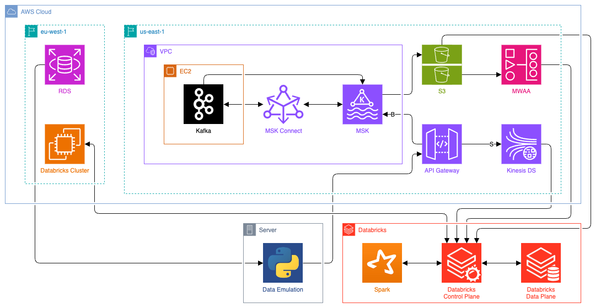

# Pinterest Data Pipeline

### Overview

This project aims to develop a scalable and efficient data processing system within the AWS cloud infrastructure, inspired by the data handling capabilities of major social platforms. The is to build a system that can manage large-scale data workflows, from ingestion and storage to processing and analysis.

Utilizing AWS's powerful suite of services, the system will leverage the capabilities of EC2 and Kafka for real-time data streaming and message queuing. With S3, we provide durable and secure storage for the vast amounts of data we anticipate handling. The project also involves configuring API Gateway for custom API endpoints, essential for managing data flow effectively.

Further processing and analytical operations will be conducted in Databricks, utilizing the computational power of Spark for data cleaning and complex computations. To manage and orchestrate these operations, we will utilize AWS Managed Workflows for Apache Airflow (MWAA), ensuring smooth, automated workflows.

In addition to batch processing, the system is designed to accommodate stream processing with AWS Kinesis, allowing for real-time data analytics and immediate insight generation. This dual capability ensures that our system is versatile and capable of providing timely analysis, which is critical for data-driven decision-making.

### Dependencies

In order to install all dependencies, run `pip install -r requirements.txt` in the project directory. This will install the following packages:

- Dotenv
- Requests
- SQLAlchemy

*Note: A populated .env file is required for this project to function.*

### Project Structure

<pre>
<b>pinterest-data-pipeline/</b>
├─ <b>data_emulation/</b>
│  ├─ <b>data_emulation.py</b>
│  │  <i>Code that indefinitely emulates data using an RDS database.</i>
│  ├─ <b>batch_ingestion.py</b>
│  │  <i>Code that ingests emulated data into MSK via the API.</i>
│  └─ <b>stream_ingestion.py</b>
│     <i>Code that ingests emulated data into Kinesis via the API.</i>
├─ <b>databricks/</b>
│  ├─ <b>Process_Batch_Data.ipynb</b>
│  │  <i>Workbook that ingests and cleans batch data from S3.</i>
│  ├─ <b>Query_Batch_Data.ipynb</b>
│  │  <i>Workbook that queries cleaned batch data to test integrity.</i>
│  ├─ <b>Process_Stream_Data.ipynb</b>
│  └─ <i>Workbook that ingests and cleans stream data from Kinesis.</i>
├─ <b>0ea903d23769_dag.py</b>
│  <i>The DAG file uploaded to Airflow to run the Databricks notebook.</i>
├─ <b>arch.png</b>
│  <i>A visual representation of the project's high-level architecture.</i>
├─ <b>.env.template</b>
│  <i>Template for required .env file.</i>
├─ <b>README.md</b>
└─ <b>LICENSE</b>
</pre>

### High-Level Architecture

  

- **RDS** - Used to provide the data emulation script with dummy data.
- **Data Emulation** - A python script that indefinitely feeds the API gateway with data.
- **API Gateway** - Provides an API for transfering batch data into MSK and stream data into Kinesis DS.
- **Kinesis Data Stream**
- **Kafka**
- **MSK Connect**
- **MSK**
- **S3** - Stores Kafka topic data, and DAG files for MWAA.
- **MWAA** - Schedules Airflow workflows for the Databricks environment.
- **Databricks** - Provides a platform for processing and transforming data.
- **Spark** - Used to clean and analyse data within Databricks.
- **Databricks Cluster** - Provides computation for the Databricks environment.
---

### Tests

After importing and cleaning the data on Databricks, shown below are the tests performed to validate the data. These tests can also be viewed in [`Query_Batch_Data.ipynb`](databricks/Query_Batch_Data.ipynb) - an export from the databricks workspace.

#### Find Most Popular Category per Country

|country                                            |category      |category_count|
|---------------------------------------------------|--------------|--------------|
|Afghanistan                                        |education     |35            |
|Albania                                            |art           |30            |
|Algeria                                            |quotes        |43            |
|American Samoa                                     |tattoos       |20            |
|Andorra                                            |tattoos       |15            |
|Angola                                             |education     |5             |
|Anguilla                                           |tattoos       |10            |
|Antarctica (the territory South of 60 deg S)       |christmas     |15            |
|Antigua and Barbuda                                |travel        |7             |
|Argentina                                          |tattoos       |15            |
...

#### Find Post Count per Category Between 2018 & 2022

|post_year                                          |category      |category_count|
|---------------------------------------------------|--------------|--------------|
|2018                                               |art           |32            |
|2018                                               |beauty        |23            |
|2018                                               |christmas     |44            |
|2018                                               |diy-and-crafts|37            |
|2018                                               |education     |28            |
|2018                                               |event-planning|25            |
|2018                                               |finance       |39            |
|2018                                               |home-decor    |46            |
|2018                                               |mens-fashion  |20            |
|2018                                               |quotes        |36            |
...

#### Find Most Followed User per Country

|country                                            |poster_name   |follower_count|
|---------------------------------------------------|--------------|--------------|
|Afghanistan                                        |DIY Joy - Crafts, Home Improvement, Decor & Recipes|985           |
|Albania                                            |WeAreTeachers |500           |
|Algeria                                            |YourTango     |942           |
|American Samoa                                     |Byrdie        |538           |
|Andorra                                            |The Best Ideas for Kids|903           |
|Angola                                             |CraftGossip.com|502           |
|Anguilla                                           |dresslily     |760           |
|Antarctica (the territory South of 60 deg S)       |StayGlam      |829           |
|Antigua and Barbuda                                |A Cultivated Nest|578           |
|Argentina                                          |Next Luxury   |800           |
...

#### Find The Country With Most Followed User

|country                                            |follower_count|
|---------------------------------------------------|--------------|
|Palestinian Territory                              |997           |
|Western Sahara                                     |997           |

#### Find Most Popular Category per Age Group

|age_group                                          |category      |category_count|
|---------------------------------------------------|--------------|--------------|
|18-24                                              |tattoos       |133           |
|25-35                                              |christmas     |76            |
|36-50                                              |christmas     |52            |
|50+                                                |christmas     |30            |
|50+                                                |travel        |30            |

#### Find Median Follower Count per Age Group

|age_group                                          |median_follower_count|
|---------------------------------------------------|---------------------|
|18-24                                              |55                   |
|25-35                                              |30                   |
|36-50                                              |28                   |
|50+                                                |24                   |

#### Find New User Count Between 2015 & 2020

|post_year                                          |number_users_joined|
|---------------------------------------------------|-------------------|
|2015                                               |825                |
|2016                                               |791                |
|2017                                               |340                |

#### Find Median Follower Count of Users Joined Between 2015 & 2020

|post_year                                          |median_follower_count|
|---------------------------------------------------|---------------------|
|2015                                               |60                   |
|2016                                               |32                   |
|2017                                               |24                   |

#### Find Median Follower Count per Joining Year & Age Group

|age_group                                          |post_year     |median_follower_count|
|---------------------------------------------------|--------------|---------------------|
|18-24                                              |2015          |79                   |
|18-24                                              |2016          |42                   |
|18-24                                              |2017          |21                   |
|25-35                                              |2015          |40                   |
|25-35                                              |2016          |26                   |
|25-35                                              |2017          |25                   |
|36-50                                              |2015          |45                   |
|36-50                                              |2016          |27                   |
|36-50                                              |2017          |24                   |
|50+                                                |2015          |45                   |
|50+                                                |2016          |23                   |
|50+                                                |2017          |28                   |
